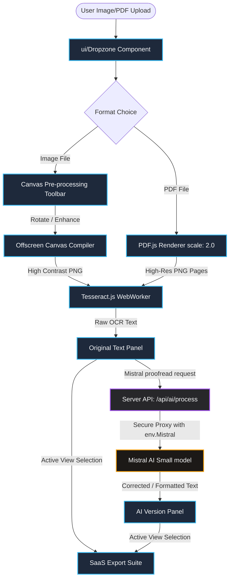

# 🏗️ SaaS Conversion Studio - System Architecture

SaaS Conversion Studio is a high-performance, local-first web application designed for processing documents and images at massive scale. By offloading resource-heavy tasks (OCR scanning, PDF rendering, and document compilation) to the user's browser, the application achieves near-zero server infrastructure costs, immune to serverless timeouts.

---

## 🗺️ System Overview

The system operates on a **Local-First, Cloud-Assisted** design paradigm:
1. **Local Layer (99% of CPU Cycle overhead):** Performed entirely client-side inside the browser using WebAssembly and high-performance canvas libraries.
2. **Cloud Layer (Semantic assistance):** Powered by serverless API routes that securely proxy to LLM endpoints (Mistral AI) for proofreading, summarization, and formatting.

---

## 🔬 Core Components

### 1. Browser-Side Execution Engine (Frontend)
Built using **Next.js 13 App Router**, **React 18**, and styled with custom **Vanilla CSS Utility Tokens** for a high-end glassmorphism look.
* **Canvas Pre-processor:** Processes native resolution imagery by calculating standard luminance ($Y = 0.299R + 0.587G + 0.114B$) to perform dynamic binarization. Strips shadows and compensates for rotation before the character scanning phase.
* **Tesseract.js Engine:** A WebAssembly port of the legendary Tesseract OCR engine, operating inside multi-threaded browser Web Workers.
* **PDF.js Engine:** Leveraged dynamically via CDN-promise scripts to render vector PDF pages onto high-fidelity canvases at a target rendering scale of `2.0`, ready for OCR scanning.

### 2. Client-Side Document Compilers (SaaS Export Suite)
No serverless routes are used to compile downloaded documents, eliminating Vercel's 10-second timeout constraints:
* **Word (`.docx`):** Built dynamically inside the browser memory using the `docx` library.
* **PDF (`.pdf`):** Structured and printed using `jspdf`.
* **Excel (`.xlsx`):** Generated using `xlsx` (SheetJS). Lines are cleaned, blank rows are omitted, sequential indexing is recalculated, and column widths are auto-fitted.
* **PowerPoint (`.pptx`):** Slide layouts, colors, and fonts are compiled dynamically using a modular promise-injection wrapper for `pptxgenjs`.
* **Graphics & Vectors (`.jpeg` / `.tiff` / `.svg`):** Renders raw text onto styled HTML5 `<canvas>` containers and XML vectors.
* **Subtitles (`.srt`):** Formats lines based on sentence boundaries, mapping them to 5.5-second time codes.
* **Multimedia Videos (`.mp4` / `.mov` / `.avi` / `.wmv`):** Translates paragraphs into scrolling credit-style canvas renders, capturing the stream via `canvas.captureStream(30)` and encoding the buffer with `MediaRecorder` directly in-browser.

### 3. Serverless API Proxy (Backend)
Located at `/api/ai/process/route.ts`:
* **Environment Resilience:** Securely extracts the API key, supporting key configurations like `MISTRAL_API_KEY`, `Mistral`, `MISTRAL`, or `mistral`.
* **LLM Hook:** Interfaces with `mistral-small-latest` to provide sub-second proofreading (Clean OCR Typos), bullets summarization, and markup-free professional formatting.

---

## 🔒 Security & Data Privacy

* **Zero Data Retention:** 99% of document processing remains strictly inside the user's local browser memory.
* **Encryption in Transit:** Communication with the Mistral API is conducted via HTTPS utilizing secure system environment variables.
